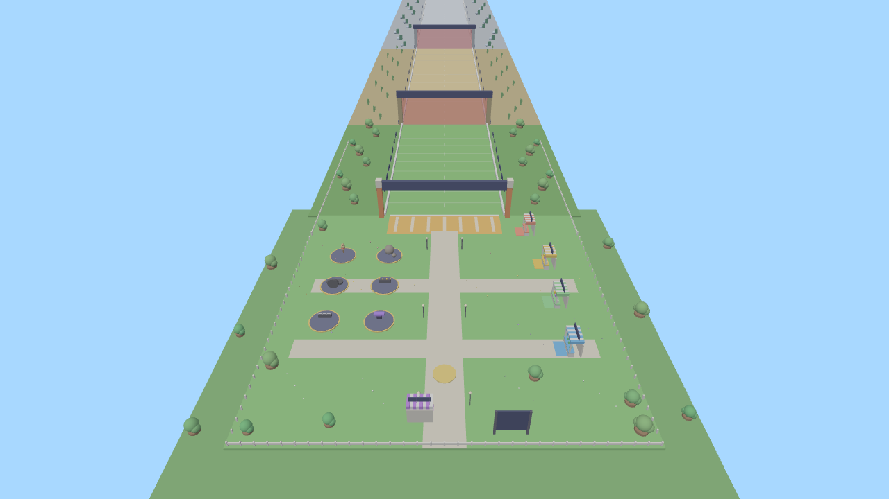
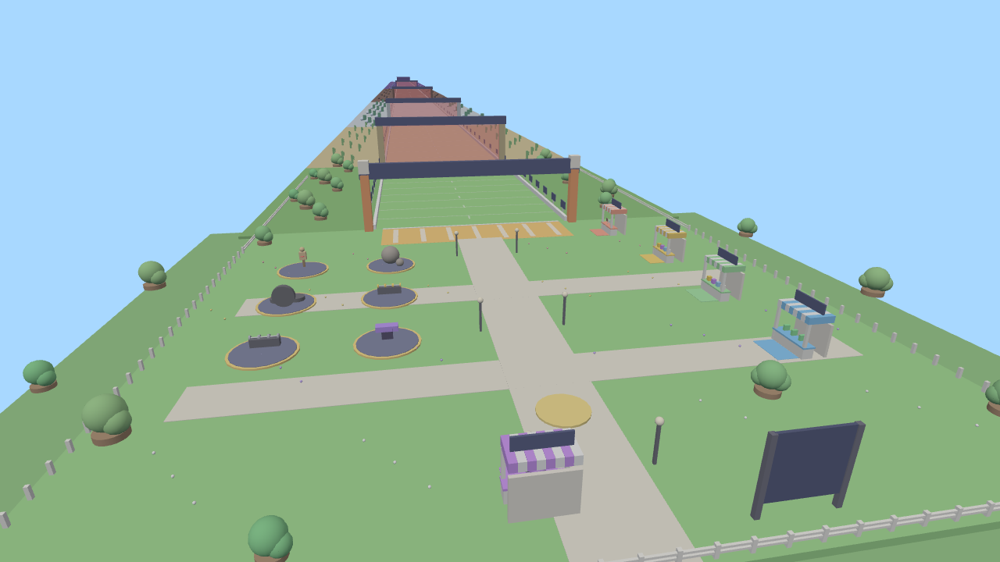
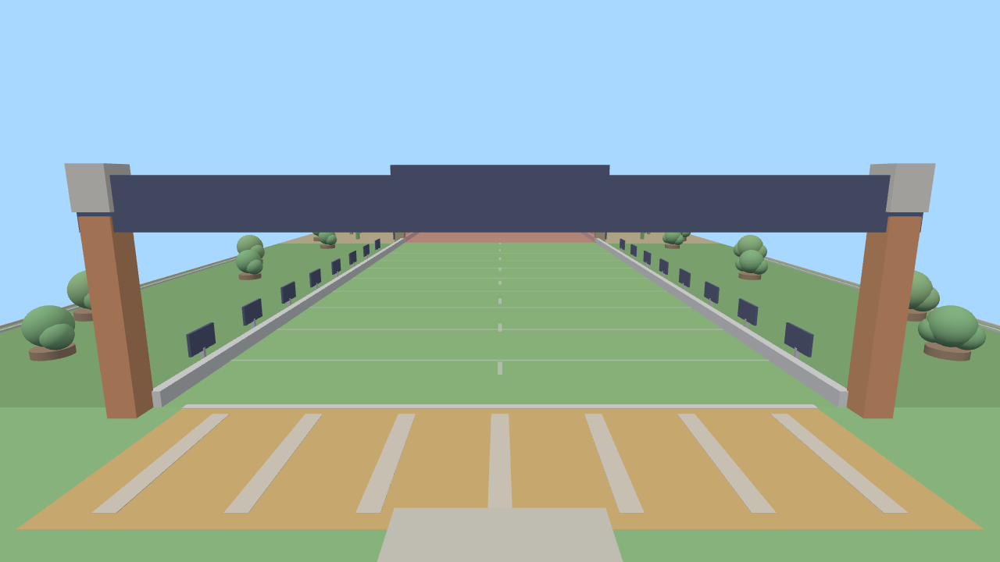

# Kick an Egg

Jogo de Roblox no estilo simulador: **treinar → ficar mais forte → chutar o ovo → ver o ovo voar → ganhar moedas → melhorar → ovos e pets melhores → rebirth → repetir.**

O código e o mapa deste repositório foram escritos do zero. O projeto enviado como referência ("Chute um Bloco da Sorte") serviu **apenas como referência de game design**: o ciclo de jogo, um lobby com barracas ao lado de uma pista longa que sai da linha de chute, áreas por distância, treino com pesos e um altar de rebirth. Nenhum asset, script ou modelo do arquivo de referência foi copiado.

---

## Como abrir

**Opção 1 – arquivo pronto:** abra `build/KickAnEgg.rbxl` no Roblox Studio e aperte **Play**.

> Para salvar dados de verdade no Studio, ative *Game Settings → Security → Enable Studio Access to API Services* (o jogo precisa estar publicado). Sem isso, o jogo funciona com dados temporários e avisa no Output.

**Opção 2 – Rojo:** `rojo serve` com o `default.project.json`. Ele sincroniza os scripts e carrega o mapa de `build/Map.rbxm`. A iluminação fica só no `.rbxl`.

**Reconstruir o `.rbxl`** depois de mudar o código ou o mapa (precisa do [Lune](https://lune-org.github.io)):

```
lune run build/build.luau        # gera build/KickAnEgg.rbxl e build/Map.rbxm
lune run tools/tests.luau        # testes dos módulos puros (formatação, trajetória, fórmulas)
lune run tools/balance_sim.luau  # simula horas de jogo para conferir o balanceamento
```

---

## Estrutura

```
src/
├─ ReplicatedStorage/Modules/        (compartilhado – dados puros e fórmulas)
│  ├─ Config.lua           chute, moedas, treino, Auto Kick, pets, DataStore, câmera, animações
│  ├─ Formulas.lua         TODAS as fórmulas (KickPower, distância, moedas, multiplicadores)
│  ├─ EggConfig.lua        ovos: raridade, força necessária, multiplicador, preço, chances dos pets
│  ├─ PetConfig.lua        pets: raridade, bônus de Coins / Strength / Kick, visual
│  ├─ RarityConfig.lua     cores e intensidade da roleta por raridade
│  ├─ UpgradeConfig.lua    Kick Power, Strength Gain, Coin Gain, Walk Speed
│  ├─ RebirthConfig.lua    custo progressivo, bônus por rebirth, marcos
│  ├─ AreaConfig.lua       5 áreas da pista e requisitos
│  ├─ TrainConfig.lua      estações de treino
│  ├─ TrackConfig.lua      geometria do mapa (usada pelo jogo e pelo build)
│  ├─ FlightPath.lua       trajetória do ovo (arco + quicadas + rolagem)
│  ├─ NumberFormat.lua     1.2K, 15M, 3.4Qa, 542m, x1.5, 1h 02m
│  ├─ SoundConfig.lua / IconConfig.lua   troque aqui sons e ícones
│  ├─ Remotes.lua / Signal.lua
│  └─ Models/EggModels.lua, PetModels.lua   (modelo procedural OU o seu modelo)
├─ ServerScriptService/
│  ├─ Main.server.lua      inicializa os services
│  ├─ Services/            DataService, KickService, TrainService, PetService, EggService,
│  │                       UpgradeService, RebirthService, AreaService, SettingsService, LeaderboardService
│  └─ Util/                RateLimiter, Notify
└─ StarterPlayer/StarterPlayerScripts/
   ├─ Main.client.lua
   ├─ Controllers/         Data, Sound, Animation, UI, Camera, Effects, Hatch (roleta), Kick,
   │                       Train, PetFollow, Tutorial, Gate
   └─ UI/                  UIKit (tema, botões, ícones, viewports) + Panels/ (Stats, Settings,
                           Upgrades, EggShop, Hatchery, Pets, Rebirth, Areas)
build/build.luau            monta o mapa e o place
```

---

## Sistemas

| Sistema | Como funciona |
|---|---|
| **Chute** | Na zona laranja (Kick Zone), o ovo aparece na sua frente. **KICK!** (botão, `E` ou `X` no controle) toca a animação, o som, o impacto e a onda de choque. O servidor calcula a distância e os clientes desenham o voo. |
| **Distância** | Contador em tempo real (`123m`). Ao entrar numa área nova aparece o nome dela. No fim: moedas, ou **NEW BEST!** com troféu, som e confete. O jogo salva melhor distância, distância total e total de chutes. |
| **Câmera do ovo** | Acompanha o ovo e depois volta suave ao jogador. Pode ser desligada em **Settings → Egg Camera**. |
| **Treino** | 6 estações no lobby: Dummy → Tire → Dumbbells → Boulder → Titan → Cosmic Anvil. Toque ou segure **TRAIN** (ou `E`) e aparece `+5 Strength`, `+1.2K Strength`… |
| **Auto Train** | Liberado com **1 Rebirth**. Rende 1 treino por segundo na melhor estação liberada. |
| **Auto Kick** | Já implementado no servidor e desligado. Para ativar: `Config.AutoKick.Enabled = true`. Depois falta só um botão que chame o remote `SetAuto("AutoKick", true)`. |
| **Ovos** | Basic → Rare → Epic → Legendary → Mythic → Cosmic (Secret). Desbloqueados na **Egg Shop** com Strength + Coins (+ Rebirths). Cada ovo multiplica as moedas do chute. |
| **Roleta** | Na **Hatchery**: os cards passam rápido, desaceleram e param no pet sorteado pelo servidor. Mostra nome, raridade, chance e bônus. Quanto mais raro, mais longa a roleta, com raios girando, tremida e confete. |
| **Pets** | 27 pets com bônus de Coins, Strength e Kick (os bônus somam). Inventário com cards, filtros (All/Common/Rare/Epic/Legendary/Mythic/Secret), Equip/Unequip, Lock, Delete (com confirmação), **Equip Best** e Unequip All. Os pets seguem o jogador. |
| **Áreas** | Sunny Meadow → Sandy Dunes → Frosty Peaks → Lava Fields → Cosmic Garden (6.000 m). O ovo **bate no portão da primeira área bloqueada**, então desbloquear áreas é o que deixa você chutar mais longe. |
| **Upgrades** | Kick Power, Strength Gain, Coin Gain e Walk Speed, com custo exponencial e nível máximo. |
| **Rebirth** | Reseta Coins e Strength e dá bônus permanentes de Strength, Coins e Kick. O custo cresce ×4,5 por rebirth. Marcos: Auto Train, slots extras de pet. |
| **Stats** | Best Kick, Total Distance, Total Kicks, Strength, Coins, Rebirths, Pets Discovered e Playtime. |
| **Leaderboard** | Placa "TOP KICKS" no lobby (OrderedDataStore). |

### Primeiro minuto (tutorial no topo da tela, com seta e feixe até o alvo)
Treinar no Dummy → chutar o primeiro ovo → comprar um upgrade → chutar de novo → Rare Egg → primeiro pet → Sandy Dunes.
Os botões do menu aparecem aos poucos: Upgrades depois do 1º chute, Eggs, Pets, Areas e Rebirth conforme o progresso.

---

## Segurança e dados
- O cliente só envia **intenções** ("quero chutar", "treinar na estação 2", "comprar KickPower"). Distância, moedas, sorteio de pets, preços e requisitos são calculados e validados no servidor.
- O servidor valida posição (zona de chute, raio da estação, proximidade da Hatchery), tipos dos argumentos e limite de frequência (RateLimiter em todos os remotes).
- **DataService:** `UpdateAsync` com *session lock*, `pcall` com novas tentativas e backoff, autosave a cada 90 s, save ao sair e no `BindToClose`, e correção de dados inválidos. Se o load falhar, o jogador é desconectado com aviso, em vez de jogar com um save zerado que sobrescreveria o progresso.
- **O que é salvo:** Coins, Strength, Rebirths, BestDistance, TotalDistance, TotalKicks, Pets, Equipped, UnlockedEggs, HighestArea, Upgrades, Settings, Playtime, AutoTrain.

## Performance
- Ovos voando e pets são desenhados no cliente com **um único loop** cada, sem física no servidor.
- As partículas são reaproveitadas (um emissor só) e o confete tem limite.
- Pets de jogadores distantes não são renderizados, e cada cliente desenha no máximo 8 ovos de outros jogadores ao mesmo tempo.

---

## Personalizar (seus assets)
- **Ícones:** coloque os asset ids em `IconConfig.lua`. Campo vazio = ícone desenhado na UI, sem emoji.
- **Ovos/pets com seus modelos:** coloque um `Model` em `ReplicatedStorage/Assets/Eggs` (com o nome do campo `Model` do EggConfig) ou em `Assets/Pets` (com o nome do pet). O jogo usa o seu modelo no lugar do procedural, inclusive nos cards da UI. Ícone 2D: campo `Icon` no EggConfig/PetConfig.
- **Sons:** `SoundConfig.lua`. Os padrões usam sons que já vêm no Roblox; música fica vazia por padrão.
- **Animações:** `Config.Animations.Kick` / `Train` (vazio = animação procedural nos Motor6D).
- **Balanceamento:** `Config.lua` e `*Config.lua`. Depois rode `lune run tools/balance_sim.luau` para ver o efeito (primeiro chute, tempo até cada área e cada rebirth).
- **Mapa:** posições em `TrackConfig.lua`, `TrainConfig.lua` e `AreaConfig.lua`. O mapa é montado em `build/build.luau`.

## Prévia do mapa (render simplificado, sem texturas/textos)
| Visão geral | Lobby | Zona de chute |
|---|---|---|
|  |  |  |
